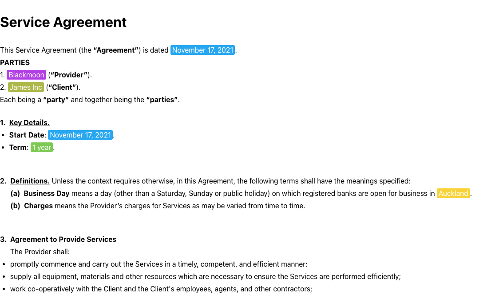

# Contract UI - React Application
This project is a React-based application that parses a JSON file (`input.json`) to render a contract UI. The application dynamically renders clauses, mentions, and other elements while maintaining proper hierarchy and styling.

## Steps to  Run

In the project directory, you can run:

### `npm install`
To install necessary packages.

### `npm start`

Runs the app in the development mode.\
Open [http://localhost:3000](http://localhost:3000) to view it in your browser.

## **File Structure**

The project is organized as follows:

```
contract-ui/
├── public/                  
├── src/
│   ├── components/          # React components
│   │   └── Parser.js        # Main component for parsing JSON and rendering UI
│   ├── styles/              
│   │   └── styledComponents.js # Styled components 
│   ├── App.js               # Main application
│   ├── index.js
│   ├── index.css            # Global CSS      
│   └── input.json           # JSON data
├── package.json             
├── README.md                
```

## Final Result
Here's the final result screenshot for Contract UI Application.

